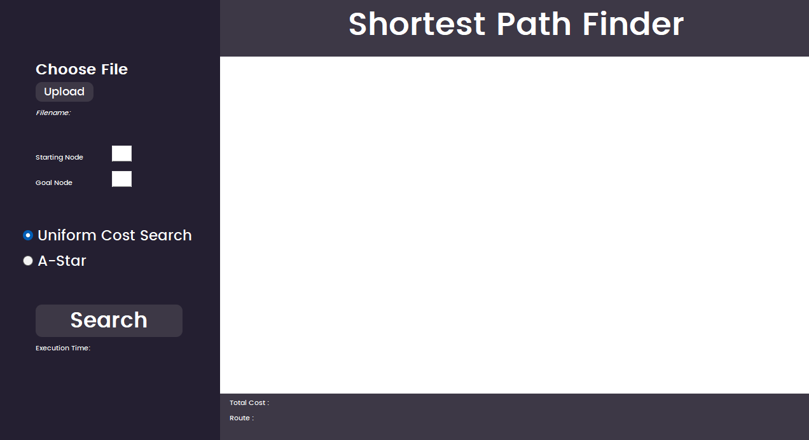
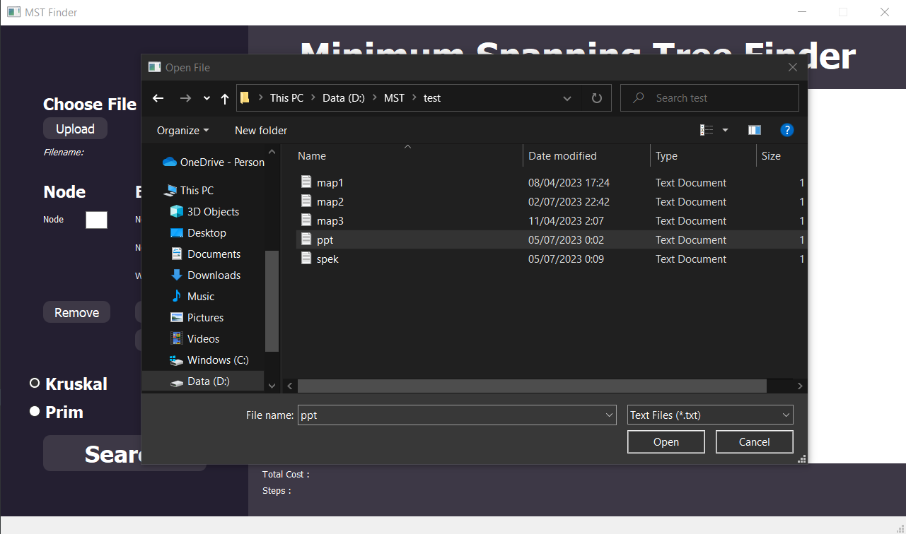
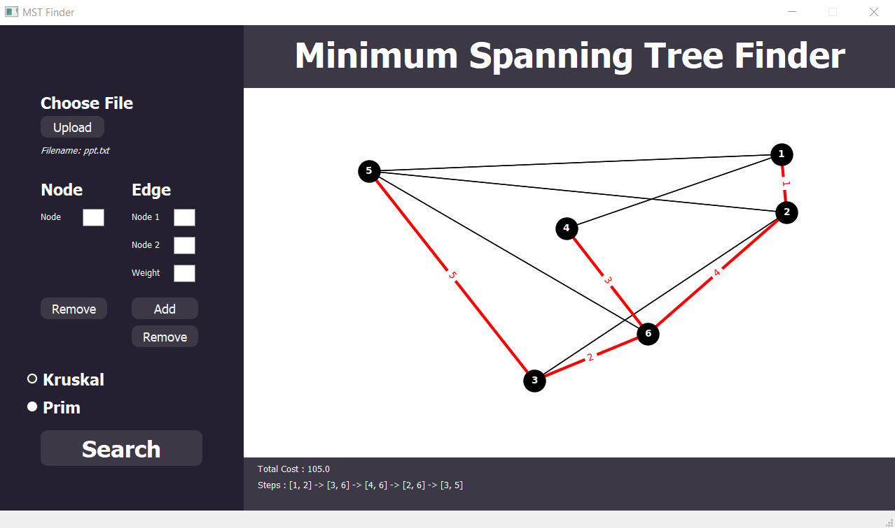
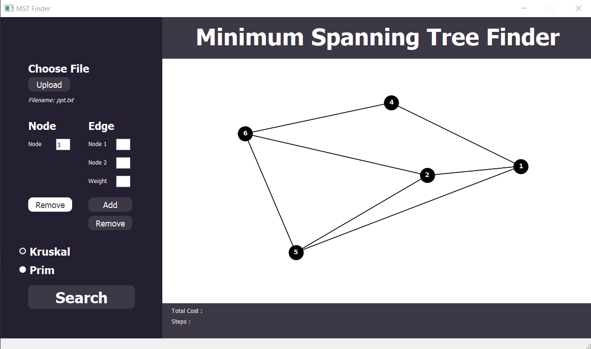
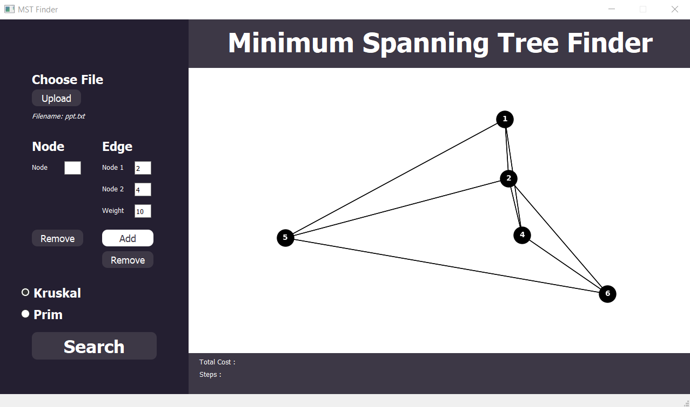
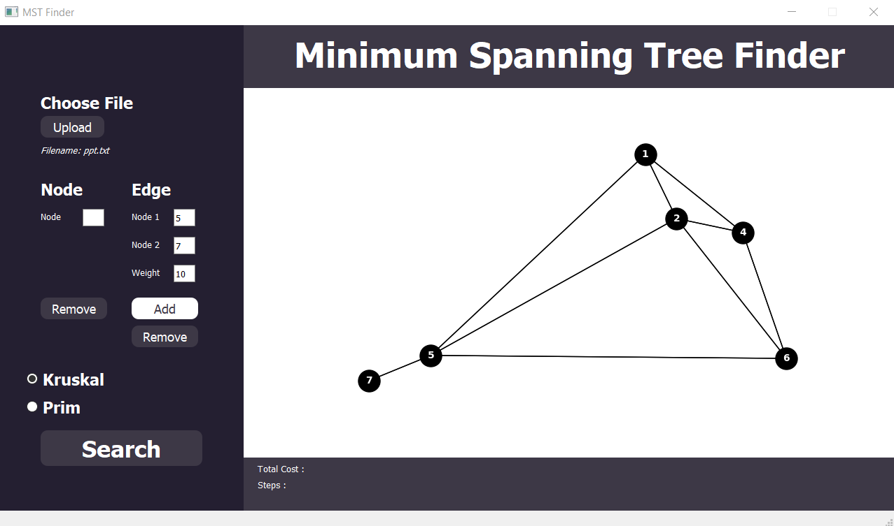
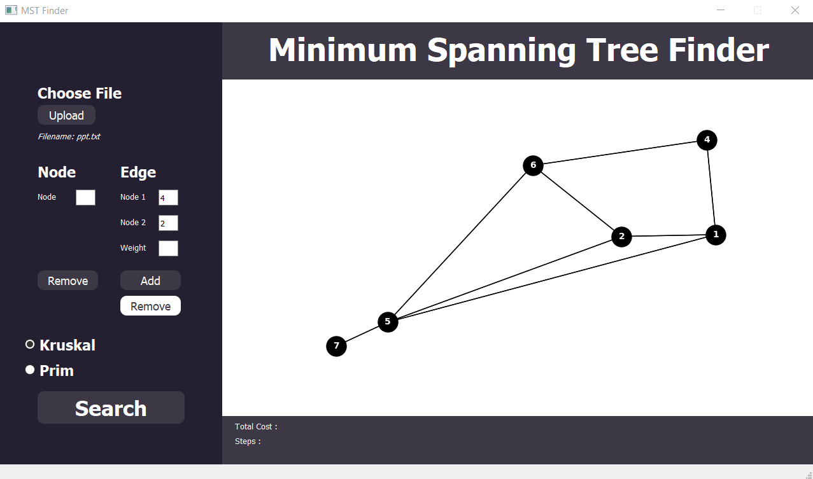

# Minimum Spanning Tree using Prim and Kruskal Algorithm🎲
>Tugas Seleksi IRK
## Table of Contents
* [Contributors](#contributors)
* [General Information](#general-information)
* [Technology Used](#technology-used)
* [Project Structure](#project-structure)
* [Local Setup](#local-setup)
* [File Input Structure](#file-input-structure)
## Contributors
| NIM | Nama |
| :---: | :---: |
| 13521021 | Bernardus Willson  |
## General Information 
The Minimum Spanning Tree (MST) problem is another well-known problem in graph theory and computation. In this problem, the goal is to find a spanning tree of minimum weight in a connected, undirected graph.

A spanning tree is a subgraph that includes all the vertices of the original graph, with the minimum possible number of edges to form a tree (i.e., without forming cycles). The weight of a spanning tree is determined by the sum of the weights of its edges.
## Technology Used
- Python
- Matplotlib Python Library
- NetworkX Python Library
- PyQt Python Library (GUI)
## Project Structure
```bash
.
├── bin
├── doc
├── src             # Source Code
|   ├── CLI.py
|   ├── Graph.py
|   ├── Kruskal.py
|   ├── main.py
|   ├── Node.py
|   ├── Prim.py
|   └── requirements.txt
└── test            # Test Folder
    ├── map1.txt
    ├── map2.txt
    └── map3.txt
```

## Local Setup
<br>
1. Clone this repo using the command below: 

```
git clone https://github.com/bernarduswillson/MST.git
```
<br>
2. Install the required library using this command :

(if you encounter any issues, please manually download the required library)

```
pip install -r src/requirements.txt
```
<br>
3. Run the program directly in this root directory

```
python src/main.py
```
Alternatively, you can use the `run.bat` if you're using Windows. You can open the runner by double clicking it directly or by calling the runner using this command below in the root directory
```
./run.bat
```




<br>
4. Within the GUI, upload the test case file, you can choose the provided test case in the test directory



<br>
5. Choose an algorithm and click search to get the result



<br>
6. If you want to remove a node, input the node number on "Node" field, and then click "Remove" button on the left side



<br>
7. If you want to add an edge, input the node numbers on "Node 1" and "Node 2" field, input the weight on "Weight" field, and then click "Add" button on the right side



<br>
8. If you want to add a new node, you can use the same method as adding an edge by inputting the node new node number on "Node 1" or "Node 2" field



<br>
9. If you want to remove an edge, input the node numbers on "Node 1" and "Node 2" field, and then click "Remove" button on the right side



## File Input Structure
For a simple visualization, you can input a weighted adjacency matrix representing an undirected, fully connected graph. Each node should be connected to every other node in the graph.
```
0 10 0 30 45 0
10 0 50 0 40 25
0 50 0 0 35 15
30 0 0 0 0 20
45 40 35 0 0 55
0 25 15 20 55 0
```