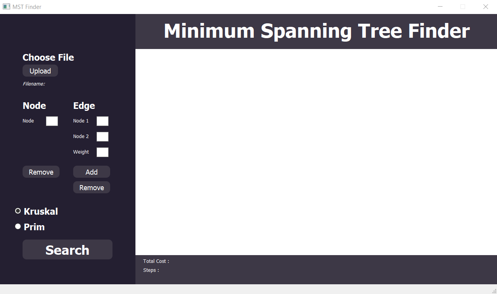

# Shortest Path Problem using UCS and AStar Algorithm🎲
>Tugas Kecil 3 IF2211 Strategi Algortima
## Table of Contents
* [Contributors](#contributors)
* [General Information](#general-information)
* [Technology Used](#technology-used)
* [Project Structure](#project-structure)
* [Local Setup](#local-setup)
* [File Input Structure](#file-input-structure)
## Contributors
| NIM | Nama |
| :---: | :---: |
| 13521021 | Bernardus Willson  |
| 13521024 | Ahmad Nadil |
## General Information 
The shortest path problem is a one of the most popular problem in computation. In this problem, it is required to find the shortest path between two points in a graph or a map.
## Technology Used
- Python
- Matplotlib Python Library
- NetworkX Python Library
- GMPlot Python Library
- PyQt Python Library (GUI)
## Project Structure
```bash
.
├── bin             # Bin folder (contains html map)
|   └── result.html
├── doc             # Documentation
|   └── Tucil3_13521021_13521024.pdf
├── src             # Source COde
|   ├── AStar.py
|   ├── CLI.py
|   ├── Graph.py
|   ├── main.py
|   ├── Node.py
|   ├── requirements.txt
|   ├── UCS.py
|   └── utils.py
└── test            # Test Folder
    ├── map1.txt
    ├── map2.txt
    └── map3.txt
```

## Local Setup
<br>
1. Clone this repo using the command below: 

```
git clone https://github.com/IceTeaXXD/Tucil3_13521021_13521024.git
```
<br>
2. Install the required library using this command :

(if you encounter any issues, please manually download the required library)

```
pip install -r src/requirements.txt
```
<br>
3. Run the program directly in this root directory

```
python src/main.py
```
Alternatively, you can use the `run.bat` if you're using Windows. You can open the runner by double clicking it directly or by calling the runner using this command below in the root directory
```
./run.bat
```




<br>
4. Within the GUI, upload the test case file, you can choose the provided test case in the test directory


<br>
5. Input the starting and goal node value, you can see the value from the graph shown or by clicking the marker for the Google Maps visualization.


<br>
6. Choose an algorithm and click search to get the result


Another visual if the file input is an adjacency matrix


## File Input Structure
1. For simple visualization, you can input a simple weighted adjaceny matrix, below is the example : 
```
0 75 0 140 0 0 0 0 0 0 0 0 118
75 0 71 0 0 0 0 0 0 0 0 0 0
0 71 0 151 0 0 0 0 0 0 0 0 0
140 0 151 0 99 0 0 0 80 0 0 0 0
0 0 0 99 0 211 0 0 0 0 0 0 0
0 0 0 0 211 0 101 0 0 0 0 0 0
0 0 0 0 0 101 0 138 97 0 0 0 0
0 0 0 0 0 0 138 0 146 0 0 0 0
0 0 0 80 0 0 97 146 0 120 0 0 0
0 0 0 0 0 0 0 0 120 0 75 0 0
0 0 0 0 0 0 0 0 0 75 0 70 0
0 0 0 0 0 0 0 0 0 0 70 0 111
118 0 0 0 0 0 0 0 0 0 0 111 0
```

2. For Google Maps visualization, you can use this txt format below (please note that the comments (#) is not included in the txt)
```
BSD                     # Map Name
10                      # Number of nodes (n)
-6.30515                # Google Maps Latitude
106.66988               # Google Maps Longitude
14                      # Google Maps zoom
0 0 0 0 0 0 0 0 1 1     # n x n adjacency matrix
0 0 0 0 1 1 0 0 0 0
0 0 0 1 0 0 0 0 0 0
0 0 1 0 1 0 0 0 1 0
0 1 0 1 0 0 0 0 1 0
0 1 0 0 0 0 1 1 0 0
0 0 0 0 0 1 0 0 1 1
0 0 0 0 0 1 0 0 0 1
1 0 0 1 1 0 1 0 0 0
1 0 0 0 0 0 1 1 0 0
Rumah Nadil             # Name of node
-6.32396                # Latitude of node
106.67665               # Longitude of node
Albesd
-6.28817
106.67375
AEON Mall
-6.30523
106.64353
The Breeze
-6.30122
106.6534
Eka Hospital
-6.29887
106.66978
Pasar Modern BSD
-6.30449
106.6849
Taman Jajan
-6.30634
106.67998
Swiss - Belhotel
-6.30904
106.68959
The Green
-6.31297
106.6692
Sevilla Park
-6.31471
106.68725
```